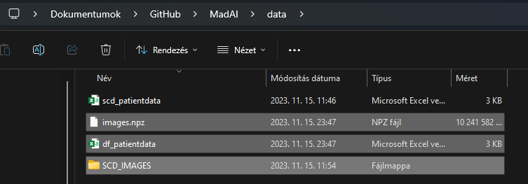

# Panni magyarázat

Hellóka!
Itt leírom gyorsan, hogy mit csináltam, mert egészen megváltoztattam a projektet.

## Mappa szerkezet: 
- A `data` mappában találhatóak a képek és az egyéb adatok, amiket a program felhasznál.
    - Jelenleg itt egy fájlt kell látnotok, mégpedig az scd_patientdata-t. De ide fog minden más data is kerülni, amit a program felhasznál.
- 3 .ipynb fájl van, amik a különböző részeket tartalmazzák. 
    - Az első csak a parancsok a könyvtárak letöltésére. Ha bármit pluszban szeretnétek letölteni pip-pel, akkor ide írjátok
    - A második a képek előfeldolgozását végzi el. 
        - Igyekeztem kommentelni, hogy mi történik benne, de ha valami nem világos, akkor szóljatok.
        - Disclaimer: nagyon lassú, majdnem 50000 képünk van és megküzd vele. 
        - A képek felét legeneráltam, hogy ne kelljen lefuttatni nektek.
        
    - A harmadik lenne amibe a train, és akár az eval is mehet. 
        - Ahogy érzitek, lehet még több .ipynb file is, a Dataracing-nél nekem bejött a külön fájlos megoldás.

## Új adatfájlok:
- Itt találjátok: https://drive.google.com/file/d/1jf2--zcF4WmJsAW53EmSd6r_Nhb2UuCx/view?usp=sharing
- A zip-et a data mappába bontsátok ki úgy, hogy ne hozzon nekik létre külön mappát, hanem a data mappába kerüljenek.
    - Így:
    - 
- image.npz
    - ebben vannak a feldolgozott, előkészített képek tömbökben, PatientID-val. A 3. ipynb  file-ban már betöltöttem őket, úgyhogy ott láthatjátok a működését
- df_patientdata
    - az scd_patientdata fájl feldolgozott változata, amit a 3. file-ban használhatunk majd
    - szintén betöltöttem már
- SCD_IMAGES
    - ebben a mappaszerkezetben vannak az eredeti képek
    - elvileg a 3. file-ban nem kell használni, de ha mégis, akkor itt vannak.
    - a 2. file-hoz viszont elengedhetetlen